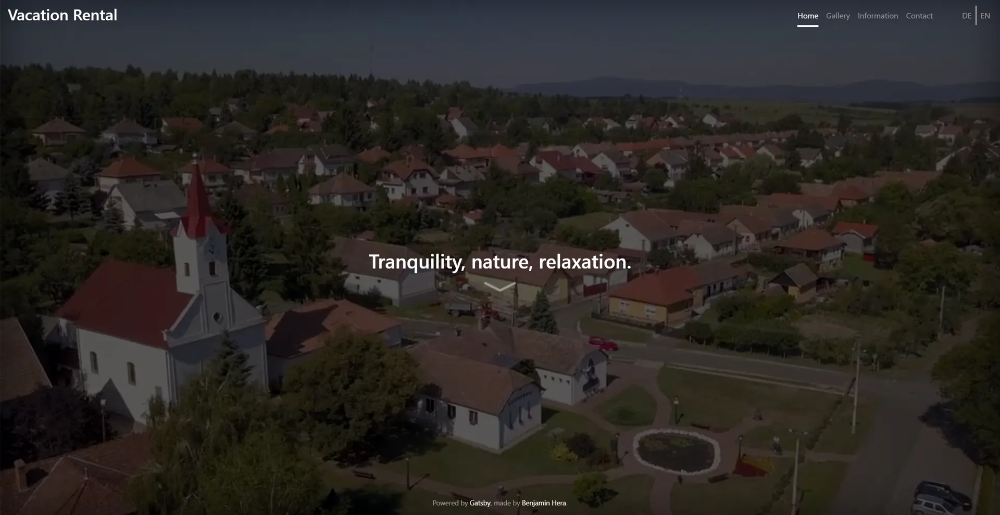

<h1 align="center">
  Gatsby Starter Vacation Rental
</h1>

## 🎉 Installation

### 0. **Prerequisites**

- Basic understanding of an Operating System.
- Basic understanding of a terminal.
- Basic knowledge and installment of [Git](https://git-scm.com/).
- Basic knowledge and installment of [NPM](https://www.npmjs.com/).
- Basic knowledge and installment of [Gatsby-CLI](https://www.gatsbyjs.com/docs/reference/gatsby-cli/).
- A preferred text editor. (e.g. [Visual Studio Code](https://code.visualstudio.com/))
- Internet connection optimally.

_Any issues related to any of these points of this list **shall not** be posted under the Issues section of this repository._

### 1. **Clone the repository**

Download and navigate into the starter

```sh
git clone https://github.com/itseramin/gatsby-starter-vacation-rental <project-name>
cd <project-name>
```

### 2. **Install all the dependencies**

Run

```sh
npm i --legacy-peer-deps
```

Might take a few minutes if You have slow internet connection or a slow Hard Drive...

### 3. **Run Gatsby!**

Run

```sh
gatsby develop
```

Your website is running on `localhost:8000`!

If You have still any issues or questions about installation please read up on [Gatsby](https://www.gatsbyjs.com/)...

## ✨ Features

### SEO

Basic SEO functionality implemented with [gatsby-plugin-react-helmet](https://www.gatsbyjs.com/plugins/gatsby-plugin-react-helmet/) and [gatsby-plugin-robots-txt](https://www.gatsbyjs.com/plugins/gatsby-plugin-robots-txt/), internationalization implemented with [i18next](https://www.i18next.com/) and other cool basic stuff needed to make this wonderful starter.

🚧🚧🚧

## 🔧 Using and modifying this starter

🚧🚧🚧

## 🧐 Contributions, Pull Requests and Issues

are very welcomed because I know jack shit about web development. The source code contains some unused CSS and bad practices, which should be cleaned up slowly one by one, but it works for now and looks okay so I don't care. Enchantments are also welcomed!

## 🚀 Plans and future

Better documentation for the `README.md` file, better experience for smaller/higher resolutions and aspect ratios, more basic locales (e.g. Es, Fr, Nl...).

## 📄 License

0BSD or whatever, just please don't use this starter for your terrorist recruitment website.

## 🌱 Live Demo and sites built from this starter

**Live demo** - _[itseramin.github.io/gatsby-starter-vacation-rental](https://itseramin.github.io/gatsby-starter-vacation-rental)_.

_List of cool people and their websites_

- **[Benjamin Hera](https://benjaminhera.me)** - _[mehesapartman.hu](https://mehesapartman.hu)_
- You? - Your website?
